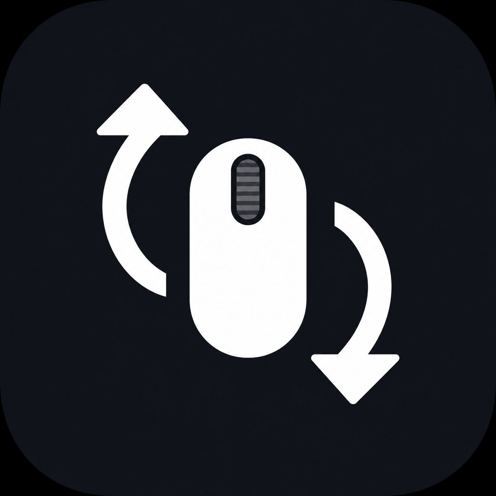

<p align="center">
  
</p>

<h1 align="center">MScroll</h1>

<p align="center">
  Independent scrolling directions for your Mac mouse and trackpad.
</p>

MScroll is a lightweight native macOS menu-bar utility. It reverses conventional mouse-wheel scrolling while leaving trackpad scrolling unchanged, solving the shared Natural Scrolling setting in macOS.

## Features

- Reverses vertical and horizontal mouse-wheel scrolling.
- Leaves continuous trackpad gestures unchanged.
- Runs quietly as a menu-bar app with no Dock icon.
- Starts automatically at login.
- Uses no network connection, analytics, or third-party dependencies.
- Remains idle until a scroll event occurs.

## Installation

A signed and notarized release is not available yet. The current `v0.1.0` beta is an unsigned Apple Silicon build intended for early testing.

1. Download `MScroll-0.1.0-arm64.dmg` from [GitHub Releases](https://github.com/jiasshengg/mscroll/releases).
2. Open the DMG and drag MScroll into Applications.
3. Try to open MScroll from Applications.
4. If macOS blocks it, open **System Settings → Privacy & Security**, scroll to Security, and select **Open Anyway**.
5. Grant Accessibility permission when macOS requests it.
6. Keep **Natural scrolling** enabled in macOS System Settings.

Only bypass Gatekeeper for a copy downloaded from this repository. A future release will use Developer ID signing and Apple notarization to remove this extra installation step.

MScroll registers itself to launch at login on first run. You can change this from its menu-bar menu or under **System Settings → General → Login Items**.

## Usage

Select the MScroll icon in the menu bar to:

- Enable or disable **Reverse Mouse Scrolling**.
- Enable or disable **Launch at Login**.
- Grant Accessibility permission if needed.
- Quit MScroll.

A filled arrow icon means scroll reversal is active. An exclamation icon means MScroll still needs Accessibility permission.

## Build from source

### Requirements

- macOS 13 or newer
- Apple Swift toolchain, included with Xcode or Xcode Command Line Tools

Clone and verify the project:

```sh
git clone https://github.com/jiasshengg/mscroll.git
cd mscroll
./scripts/test.sh
```

Build the application bundle:

```sh
./scripts/build-app.sh
open .build
```

The packaging script creates `.build/MScroll.app` for the architecture of the current Mac. It also generates the required macOS icon sizes from `assets/MScroll.png` and applies a local ad-hoc signature.

Build an unsigned compressed DMG containing the app and an Applications shortcut:

```sh
./scripts/build-dmg.sh
```

The DMG is written to `.build/MScroll-<version>-<architecture>.dmg`.

An ad-hoc-signed build is suitable for local testing. Public distribution will use Developer ID signing and Apple notarization so downloaded releases can pass Gatekeeper normally.

## How it works

Trackpads normally produce continuous, pixel-based scroll events. Conventional mouse wheels normally produce line-based events. MScroll installs a Core Graphics event tap, reverses the line-based scroll deltas, and returns continuous events unchanged.

macOS requires Accessibility permission because MScroll modifies system-wide scroll events. MScroll does not inspect keystrokes or store input activity.

## Limitations

- Magic Mouse scrolling is continuous and is treated like trackpad scrolling in this version.
- Device detection is based on scroll-event behavior rather than a specific mouse identity.
- Rebuilding the app may cause macOS to request Accessibility permission again because local builds are ad-hoc signed.

## Privacy and performance

MScroll runs entirely on your Mac. It has no networking, tracking, analytics, database, or background polling. Its event listener sleeps while you are not scrolling.

## Troubleshooting

If mouse scrolling is unchanged:

1. Confirm **Reverse Mouse Scrolling** is enabled in the MScroll menu.
2. Open **System Settings → Privacy & Security → Accessibility**.
3. Confirm the copy of MScroll inside `/Applications` is enabled.
4. Quit and reopen MScroll.

If you rebuilt or moved the app and permission no longer works, remove the old MScroll entry from Accessibility, add `/Applications/MScroll.app` again, and reopen it.
